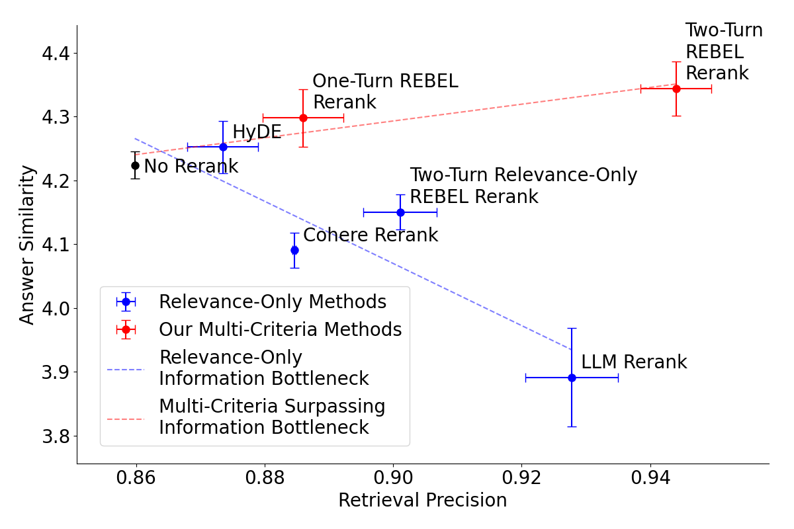
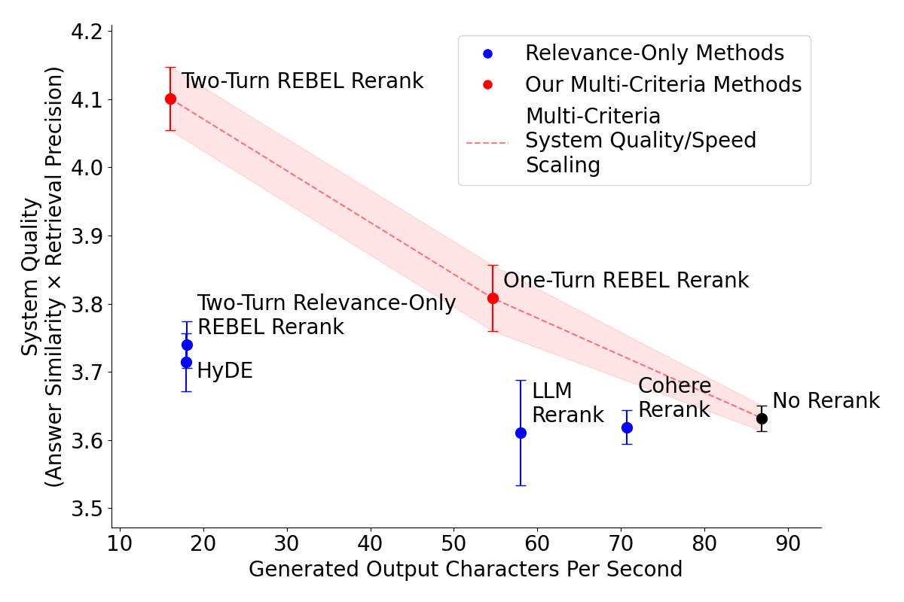

# REBEL: RErank BEyond reLevance 
👉[llama-index PR](https://github.com/run-llama/llama_index/pull/17590)

👉[arxiv PDF](https://arxiv.org/pdf/2504.07104)

<a target="_blank" href="https://colab.research.google.com/github/microsoft/REBEL/blob/main/REBEL.ipynb">
  
</a>

REBEL is a novel framework that enhances Retrieval-Augmented Generation (RAG) systems by incorporating query-dependent, multi-criteria document reranking. While traditional RAG systems focus solely on relevance when selecting documents, REBEL recognizes that other factors like recency, credibility, and perspective diversity can be crucial for generating high-quality responses.

## How REBEL Works

REBEL uses a two-step approach:

1. **Meta-Prompt Generation**: For each user query, REBEL first analyzes the query to infer what secondary criteria (beyond relevance) would be important. For example:
   - A query about current medical treatments might prioritize recency and authoritativeness
   - A query about economic policies might prioritize perspective diversity and reasoning depth
   - A technical query might prioritize specificity and accuracy

2. **Multi-Criteria Reranking**: Using these inferred criteria, REBEL generates a custom reranking prompt that:
   - Scores documents on both relevance (0-10) and secondary criteria (0-5)
   - Computes a weighted composite score combining all factors
   - Ranks documents based on this comprehensive assessment

This approach enables REBEL to select context documents that are not just relevant, but optimized for generating high-quality responses to each specific query type.

## Key Features

- **Query-Dependent Criteria**: Unlike static approaches, REBEL dynamically infers what properties matter most for each query
- **Chain-of-Thought Integration**: Uses a meta-prompting strategy similar to Chain-of-Thought techniques
- **Plug-and-Play**: Requires no model fine-tuning or architectural changes to existing RAG pipelines
- **Interpretable**: Provides clear scoring rubrics and weightings for all criteria

## Experimental Results

Our experiments show that REBEL: 
- Significantly improves answer quality compared to relevance-only approaches
- Maintains high retrieval precision while optimizing for multiple criteria
- Outperforms both standard RAG and static multi-criteria reranking methods.


Comparison of retrieval methods showing retrieval precision versus answer similarity, with error bars indicating 95% confidence intervals. The dashed best-fit lines represent the previously posited information bottleneck (blue) and the surpassing of that bottleneck by multi-criteria rerankers(red). The one-turn version uses five fixed criteria (depth, diversity, clarity, authoritativeness, andrecency) to achieve both higher retrieval relevance and answer quality than vanilla RAG (No Rerank). The two-turn version further improves performance by adapting criteria to each query through a two-turn prompting process.



Visualization of system quality (measured by the multiplication of answer similarity and retrieval precision) and system inference speed (measured by generated output characters per second) for each method. We note that existing relevance-only methods are not able to achieve higher system quality at efficient inference speed rates, while our multi-criteria methods enable a new RAG tradeoff curve where inference compute can be leveraged to greatly increase system quality.

## Setup

1. Clone the repository:
```bash
git clone https://github.com/microsoft/REBEL.git
cd REBEL
```

2. Install dependencies:
```bash
pip install -e git+https://github.com/bvarjavand/tonic_validate.git
git clone https://github.com/bvarjavand/llama_index.git
cd llama_index/llama-index-core && pip install -e .
```

3. Create a `.env` file with your API keys:
```bash
OPENAI_API_KEY=your-api-key-here
OPENAI_API_BASE=https://your-api-base-url-here  # Optional: Only if using a proxy
LITELLM_API_KEY=your-litellm-key-here
LITELLM_BASE_URL=https://your-litellm-base-url-here  # Optional: Only if using a proxy. same as OPENAI_API_BASE
COHERE_API_KEY=your-cohere-key-here  # Required for Cohere rerank experiments
TONIC_VALIDATE_API_KEY=your-tonic-key-here
TONIC_VALIDATE_PROJECT_KEY=your-project-key-here
TONIC_VALIDATE_BENCHMARK_KEY=your-benchmark-key-here
```

## Usage

The main script supports several command-line arguments:

```bash
# Run with default settings
python main.py

# Force reprocessing of documents
python main.py --force

# Run in testing mode (processes fewer documents)
python main.py --testing

# Upload results to Tonic Validate
python main.py --upload

# Specify number of runs per experiment
python main.py --runs 3
```

To get inference time data, run the `test_experiments.py` file. This is also useful for testing these methods with different vector databases.

```bash
# Run normally
python test_experiments.py
```

## Experiments

The framework includes several RAG strategies:

1. Vanilla RAG
2. RAG with Cohere reranking
3. RAG with LLM reranking
4. RAG with static reranking
5. RAG with REBEL method
6. HyDE (Hypothetical Document Embeddings)

## Project Structure

- `main.py`: Main script for running experiments
- `process_documents.py`: Handles document processing and vector store creation
- `experiments.py`: Contains different RAG implementations
- `test_experiments.py`: Runs a single run for each experiment and saves inference times

## Vector Store

The project uses ChromaDB as the vector store. The store is:
- Created automatically on first run
- Persisted to disk for reuse
- Can be forced to rebuild using `--force`
- Configurable chunk size and overlap

## Contributing

This project welcomes contributions and suggestions.  Most contributions require you to agree to a
Contributor License Agreement (CLA) declaring that you have the right to, and actually do, grant us
the rights to use your contribution. For details, visit https://cla.opensource.microsoft.com.

When you submit a pull request, a CLA bot will automatically determine whether you need to provide
a CLA and decorate the PR appropriately (e.g., status check, comment). Simply follow the instructions
provided by the bot. You will only need to do this once across all repos using our CLA.

This project has adopted the [Microsoft Open Source Code of Conduct](https://opensource.microsoft.com/codeofconduct/).
For more information see the [Code of Conduct FAQ](https://opensource.microsoft.com/codeofconduct/faq/) or
contact [opencode@microsoft.com](mailto:opencode@microsoft.com) with any additional questions or comments.

Steps to contribute:
1. Fork the repository
2. Create your feature branch
3. Commit your changes
4. Push to the branch
5. Create a new Pull Request

## Trademarks

This project may contain trademarks or logos for projects, products, or services. Authorized use of Microsoft 
trademarks or logos is subject to and must follow 
[Microsoft's Trademark & Brand Guidelines](https://www.microsoft.com/en-us/legal/intellectualproperty/trademarks/usage/general).
Use of Microsoft trademarks or logos in modified versions of this project must not cause confusion or imply Microsoft sponsorship.
Any use of third-party trademarks or logos are subject to those third-party's policies.
